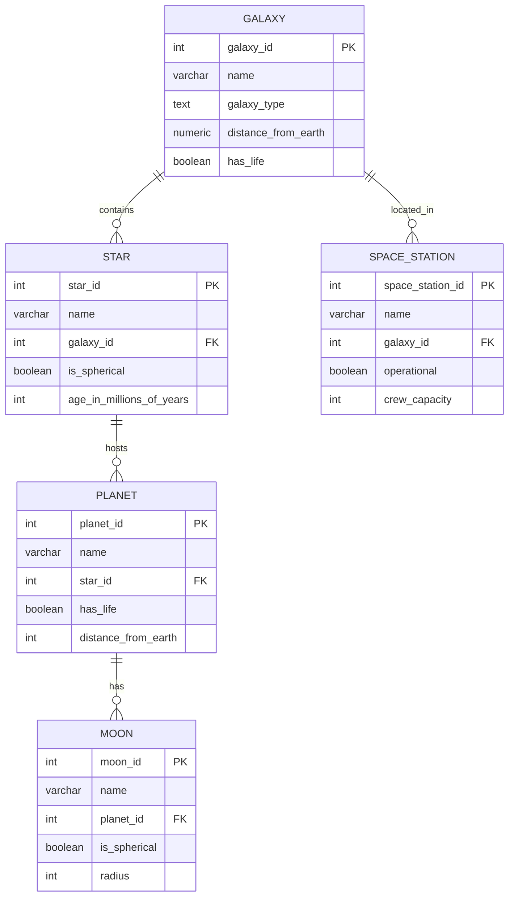

# 🌌 Universe Database Project

> A PostgreSQL relational database designed for the freeCodeCamp Relational Database Certification.  
> Features galaxies, stars, planets, moons, and space stations 🚀

## 📘 About the Project

This project is part of the **Relational Database Certification** on [freeCodeCamp.org](https://www.freecodecamp.org/). It demonstrates normalized relational structure, data types, primary and foreign key constraints, and more.

## 💾 How to Use

### 📥 Clone and Restore the Database

```bash
git clone https://github.com/dog-broad/fcc-universe-database
cd fcc-universe-database
psql -U postgres < universe.sql
````

Ensure you have PostgreSQL installed and are authenticated as a valid user.


## 📐 Entity Relationship Diagram (ERD)




## ✅ Project Requirements Covered

* [x] Database: `universe`
* [x] 5+ tables: `galaxy`, `star`, `planet`, `moon`, `space_station`
* [x] Proper data types: `VARCHAR`, `NUMERIC`, `BOOLEAN`, `TEXT`, `INT`
* [x] All primary keys auto-increment (`SERIAL`)
* [x] All relationships modeled with foreign keys
* [x] `NOT NULL`, `UNIQUE`, and proper constraints in place
* [x] Enough rows: Galaxy & Star (6), Planet (12), Moon (20)
* [x] Dumped with:

  ```bash
  pg_dump -cC --inserts -U freecodecamp universe > universe.sql
  ```

## 🛠 Technologies

* PostgreSQL
* psql CLI
* ER Modeling
* Relational Design Principles


## 👨‍🚀 Author

Built with 💙 for learning and certification by @dog-broad


## 🛰 License

MIT — Free to use, modify, and learn from!
